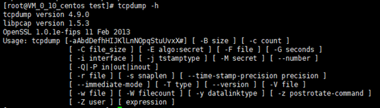
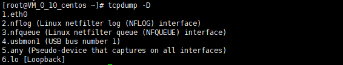
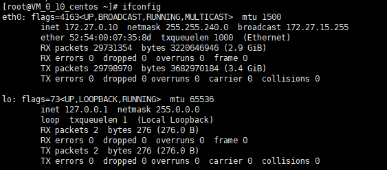
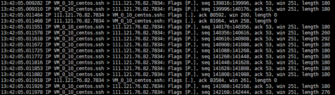
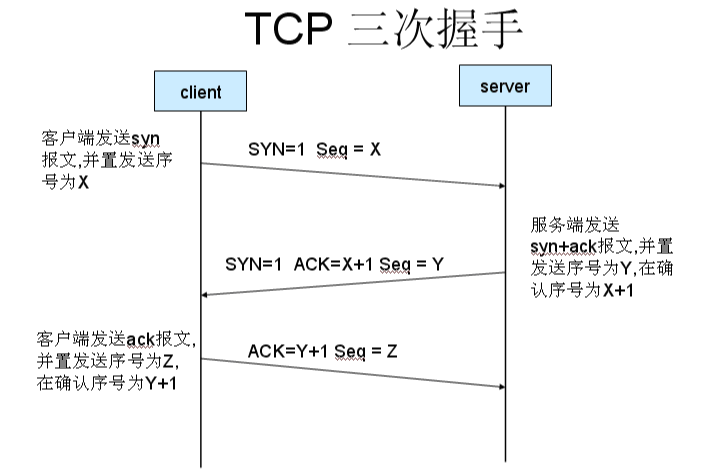
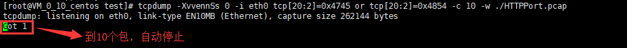
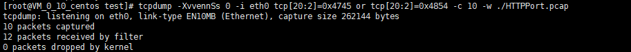

**tcpdump简介**

tcpdump是Linux系统下的一款抓包命令集，工作原理是基于网卡抓取流动在网卡上的数据包。在Linux系统中由于tcpdump命令的简单和强大，我们一般直接使用tcpdump命令来抓取数据包。保存之后，拖下来在wireshark中分析。

怎样判断你的Linux系统中是否有tcpdump呢？很简单输入一下命令：

tcpdump -h

若出现以下信息，恭喜你躲过一劫(Linux一般会自带)。

如果没有那么得先在Linux安装这个软件了。你以为很难么，一行命令就搞定啦：

yum install -y tcpdump

安装完成之后敲入命令：

tcpdump -h

能够出现上面的信息以及帮助，证明你已经成功安装好了。

现在，你以为你输入tcpdump就能抓包了吗？啊哈哈可以的，能抓取到所有经过第一个网卡的数据包哦。但是，表着急，在这样的数据包中查看我们感兴趣的数据，那堪比大海捞针呐，所以先学习吧。

来看看tcpdump命令的一些参数说明吧先～

tcpdump -D　　　　　　　　\#列出可用于tcpdump抓取数据包的网卡列表

来说下：

 

 

 

 

eth0　　　　
//表示该服务器的第一块网卡，一般我们tcpdump抓包都使用这块网卡来抓取。可能有eth1，eth2等等  
nflog　　　　//Linux下的网络过滤网卡，一般我们不使用它  
nfqueue　　 //Linux网络过滤队列接口，一般不使用它  
usbmon1 //USB总线接口，一般不使用它  
any //任何网卡接口  
lo
//指的是该主机的回环地址(127.0.0.1)，一般用来测试网络专用，一般的数据都不通过这块网卡，所以我们用tcpdump抓包的时候也不使用这块网卡。

 

 

 

 

了解了这个之后，我们来看下服务器下有哪些网卡，输入：

ifconfig //这可不是Windows下的ipconfig哦，不要记混了

看见没有，我的系统有两块网卡，我们使用第一块。

我们现在使用tcpdump的第一个命令

tcpdump　　　　//抓取通过第一个网卡的数据包，并将信息打印在屏幕上实时显示出来

这么容易吗？哈哈，那服务器的网卡不是有多个吗？我想抓取指定网卡的数据包怎么办呢？

tcpdump -i
eth0　　//抓取通过eth0网卡的数据包，信息实时打印在屏幕上。-i表示指定哪个网卡接口，后面跟网卡名字，比如eth0或者lo

这样够了吗？哈哈，和eth0网卡会话的目的地址可多了，我只关心并找到和某一个IP地址之间会话的数据怎么办呢？

tcpdump -i eth0 host
192.39.45.66　　//抓取该网卡和该IP地址会话的数据包，实时打印在屏幕上，host后面跟IP地址或者域名，比如也可以写成host
[www.baidu.com](http://www.baidu.com)

哈哈，这样，好像有点味道了哟，但是还不满足哦，我只想查看所有192.39.45.66发送给服务器的数据包呢？（说白了就是我的服务器接收到的数据）

tcpdump -i eth0 src host
192.39.45.66　　//抓取所有该网卡和该IP之间，收到的数据，src表示服务器收到的数据，如果该参数缺省，默认抓取所有数据

我只想查看服务器网卡eth0发送给192.39.45.66的所有数据包呢？（说白了就是我的服务器发出去的数据）

tcpdump -i eth0 dst host
192.39.45.66　　//抓取所有该网卡和该IP之间，收到的数据，dst表示服务器发出去的数据，如果该参数缺省，默认抓取所有数据

哈哈，但是，有个问题，我想查看这个网卡下，某个端口号和目的IP会话的数据包，比如8080端口，怎么办啊？这里如果端口和IP地址同时存在的话，需要加and

tcpdump -n -i eth0 port 8080 and host 192.39.45.66
//查看8080端口号的会话数据包，port表示端口号，后面比如跟8080。-n表示不对具体ip地址做域名解析，直接显示会话两边的具体ip地址

还有个小小的问题，我现在只需要抓取某种协议的数据包，其他类型不关心，怎么办？例如tcp或者udp协议的数据包

注：如果没有标明抓取哪种协议类型的数据包，默认抓取全部协议类型的数据哦

tcpdump -n -i eth0 port 8080 and host 192.39.45.66 tcp

到这里，你都觉得好像可以了哈，但是有个很重要的问题，不是说好的Linux用tcpdump，Windows下用wireshark来分析吗？这打印在屏幕上，怎么分析嘛，应该有个保存成某个文件的命令，下载到windows中用wireshark打开才对吧？😀😀，没错，接下来讲的这几个参数，还是工作中很常用的，由于参数过多，不列举例子了：

 

 

 

 

\-c：表示要抓取的包数量，比如-c 100表示我要抓取100个满足条件的包。  
-i：表示指定对哪个网卡接口进行抓包，比如-i eth0，表示对eth0这个网卡进行抓包  
-n：不对具体ip地址进行域名解析，直接显示ip地址  
-nn：不对具体ip进行域名解析，并且端口号也不显示服务的名称，直接显示数字  
-D：列出可用于抓包的接口。将会列出接口的数值编号和接口名，它们都可以用于"-i"后。  
-w：将抓包数据输出到文件中而不是打印到屏幕上。  
以下这两个参数：可作抓包的时候打印出信息，作为参考，毕竟我们要在wireshark分析的😀  
-XX：输出数据包的头部数据。  
-vvv：打印和分析的时候，产生非常详细的输出。

 

 

 

 

下面，写一个工作中很常用的抓包命令:

tcpdump -c 10 -nn -i eth0 tcp dst port 8080 and host 192.39.45.66 -w
/home/huidong/MyTest.pcap

最后的路径，为绝对路径，如果只有文件名，保存在当前文件夹下，pcap格式可被wireshark打开，抓包完成后，你就可以在保存的路劲下看到那个包啦！最后，特别要注意，使用tcpdump命令的时候，建议加上-c命令，因为如果不加任何过滤的话，就会无限制的抓取数据包，直到磁盘存满为止，很可怕的，有些时候我们需要触发抓包的时候，可不用-c，触发完之后停止抓包，就OK了。

然后将包下载到Windows下，就可以愉快的继续下一步了。

接下来我们直接使用tcpdump命令抓一些数据包在屏幕上打印，看看数据包长啥样：

tcpdump

第一项是时间，如果命令加上-tttt参数，那么会显示年月日，但是大多数情况下用不到这个参数。  
第二项是IP地址，我没有加-nn参数，所以这里服务器ip地址和服务器端口号被域名解析成了VM\_0\_10\_centos.ssh，箭头是指数据发送方向。  
第三项Flags，seq，ack，是不是很熟悉！？哈哈，没错，这就是TCP协议的三次握手标识

这里说一个小插曲哈，由于tcpdump是基于网卡获取流动数据，抓取的数据协议是基于传输层的协议，

最常用的两种传输层协议:

TCP 面向连接的可靠协议（eg：打电话）  
UDP 面向无连接的不可靠协议（eg：发短信）

而我们熟知的fiddler是基于端口监听获取数据，只能抓取基于应用层协议的数据

而应用层协议就多啦：

HTTP/HTTPS 超文本传输协议  
FTP 文件传输协议  
SMTP 邮件传输协议  
MQ 短消息队列传输协议（物联网实时通讯方面用的比较多）

说到这，可能你对三次握手还不是很清楚，下面的图就让你明白是怎么回事：

OK，说了这么多关于TCP协议的东西，但是，可能你现在有个疑问，tcpdump抓取的是TCP/UDP协议的包，承载的应用层数据包的协议又有这么多种，如果我想判断这个包，是否承载着HTTP协议的数据，怎么办呢？这个时候呢，有两种方法，一种，是直接在抓包命令上做条件限制，让抓取的过程中，自动过滤掉不是HTTP协议的数据。

tcpdump -XvvennSs 0 -i eth0 tcp[20:2]=0x4745 or tcp[20:2]=0x4854 -c 10 -w
./HttpPort.pcap //0x4745 为"GET"前两个字母"GE"，0x4854 为"HTTP"前两个字母"HT"

如果对-XvvennSs参数不了解，没什么神秘的，就是之前说的几个参数组合，详细了解可以查看tcpdump的文档：*Tcpdump官方文档*

接下来实际操作一下，我们复制上面的命令(没有-w写入文件，直接显示在屏幕上)，获取一下数据包：

获取数据包，写入文件：

 

第二种，是全部获取之后，用wireshark打开并过滤HTTP协议的数据包，这里由于HTTP承载于TCP之上，所以我们这里抓取TCP协议数据包。-s
0参数标识该数据包防止被截断。

tcpdump tcp -i eth0 -t -s 0 port 8080 -w ./HTTPPort.pcap

然后在wireshark中使用过滤语句，筛选HTTP数据包，注意这里文件后缀为pcap

 
